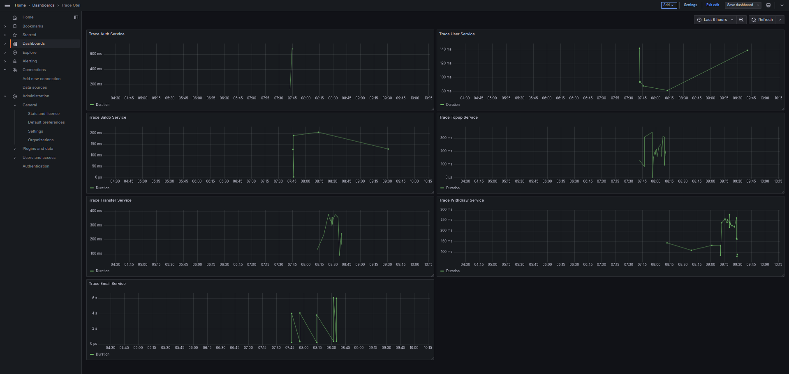
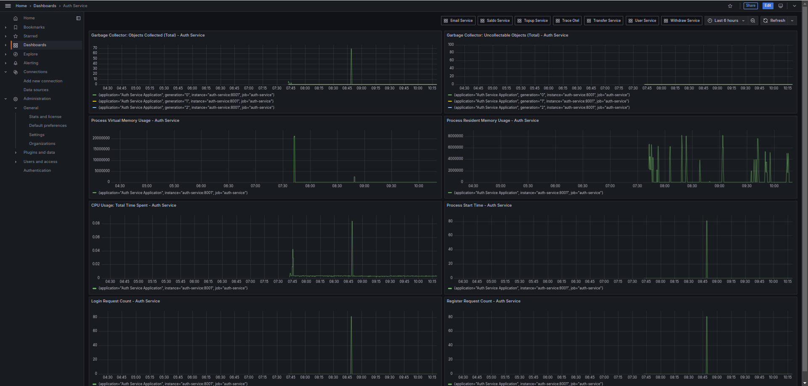
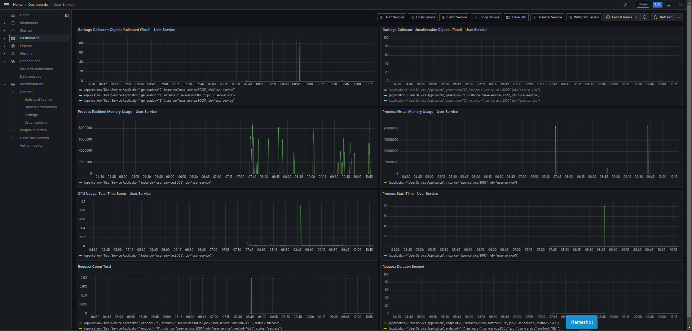
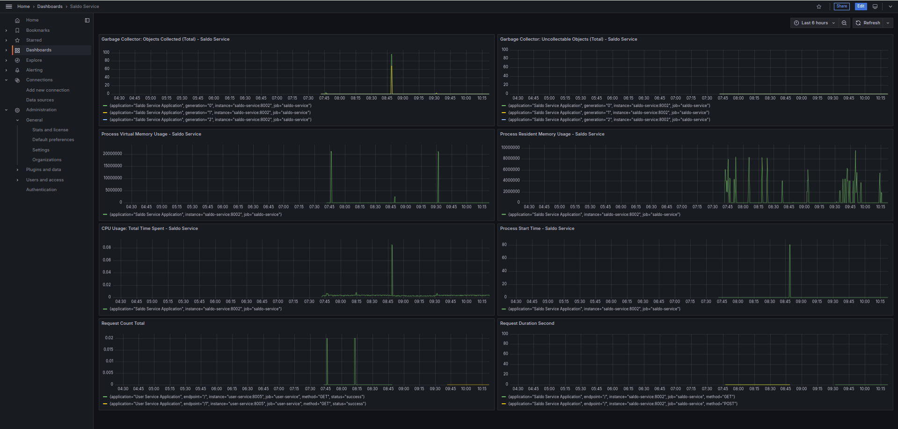
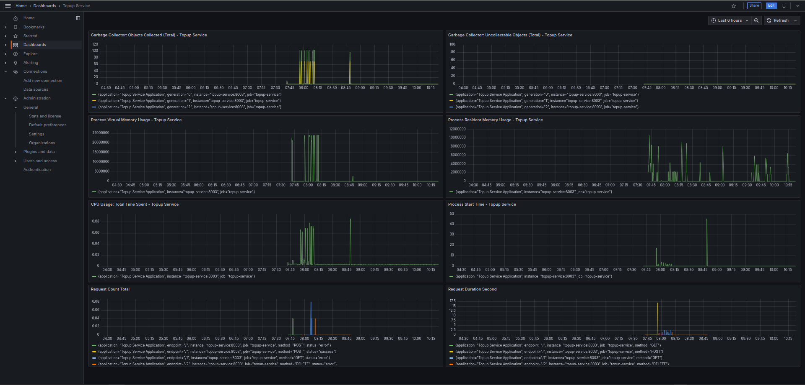
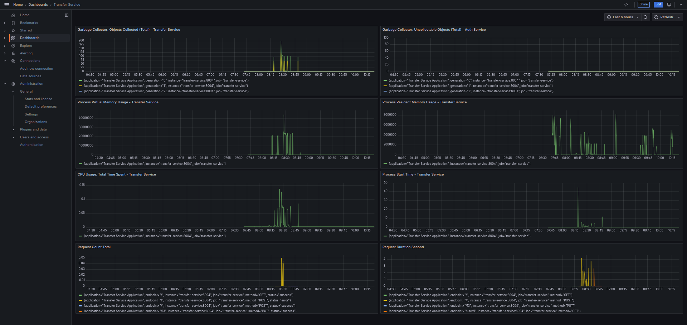
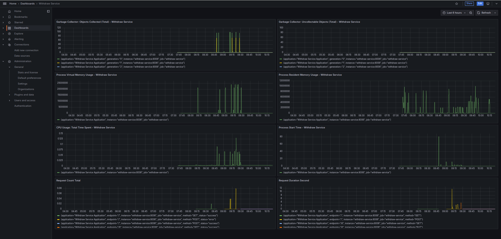
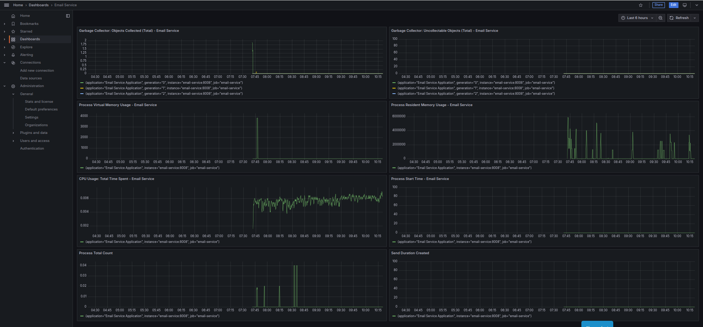

# Monolithic Payment Gateway

This project implements a **Monolithic Payment Gateway**, designed to handle various financial operations such as authentication, user management, balance tracking, top-ups, transfers, withdrawals, and email notifications. It leverages modern technologies to ensure scalability, observability, and seamless integration of services.

### Technologies Used

1. **FastAPI**  
   - A modern, high-performance web framework for building APIs with Python.
   - Provides asynchronous capabilities to handle high-concurrency traffic efficiently.
   - Simplifies the creation of RESTful endpoints for each service.

2. **Kafka**  
   - Used as a message broker to enable asynchronous communication between different parts of the system.
   - Ensures reliable event streaming and processing for financial transactions and notifications.

3. **Zookeeper**  
   - Acts as a centralized service for maintaining configuration information and synchronizing distributed systems.
   - Used alongside Kafka to manage message broker instances.

4. **OpenTelemetry (OTel)**  
   - Provides instrumentation to collect telemetry data such as metrics and traces.
   - Facilitates monitoring and troubleshooting the payment gateway system.

5. **Jaeger**  
   - Integrated with OpenTelemetry to visualize traces and identify performance bottlenecks.
   - Enables distributed tracing for the microservices, helping in debugging and performance analysis.

6. **Grafana**  
   - A visualization tool to monitor real-time data and metrics from the system.
   - Provides customizable dashboards for tracking the health and performance of services.

7. **Prometheus**  
   - A powerful open-source monitoring and alerting toolkit.
   - Collects metrics from each service and integrates with Grafana for visualization.

### Key Features of the Payment Gateway

1. **Centralized Financial Operations**  
   The system centralizes functionalities such as user authentication, managing user balances, processing top-ups, transfers, withdrawals, and sending email notifications.

2. **Observability**  
   With OTel, Jaeger, Prometheus, and Grafana, the system is equipped with robust tools for monitoring, tracing, and diagnosing issues.

3. **Scalable Communication**  
   Kafka ensures asynchronous and reliable communication between services, making the system highly scalable and efficient.

4. **Modular Design**  
   Although the gateway is monolithic in its operation, it organizes services into clear domains (e.g., Auth Service, User Service, etc.), ensuring maintainability and ease of development.

---

## Visualizations

### Trace Otel for Various Services

### Prometheus Dashboards for Services

#### Auth Service

#### User Service

#### Saldo Service

#### Topup Service

#### Transfer Service

#### Withdraw Service

#### Email Service

